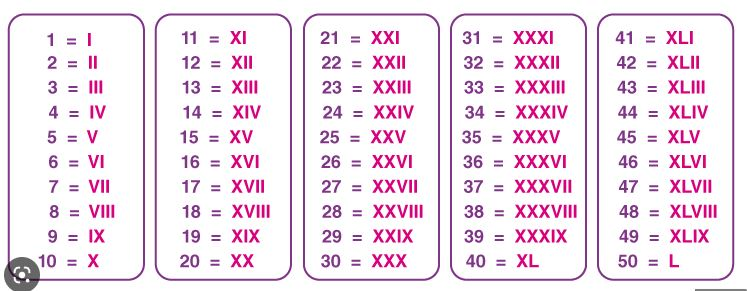

# Roman Numerals Decoder

A function that takes a Roman numeral as its argument and returns its value as a numeric decimal integer

Building the program in done with Makefile. Targets: all, clean, test(unit-tests using the Check library), RomanNumerals.o
